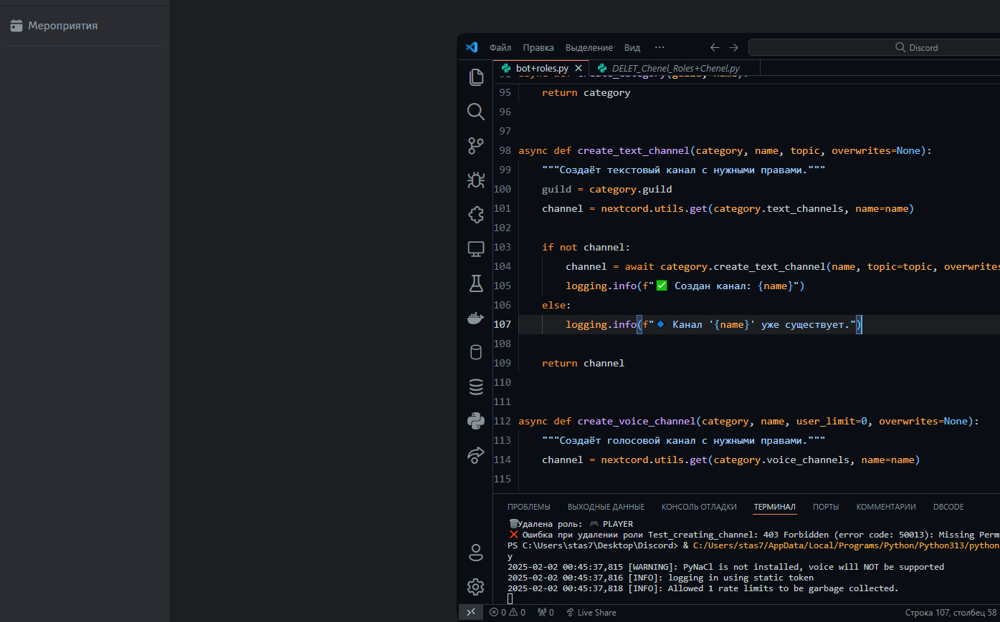

[English](/README.md) | [Русский](/README.ru_RU.md)

<p align="center">
  <picture>
    <source media="(prefers-color-scheme: dark)" srcset="./media/logo-light.png">
    
  </picture>
</p>

<div align="center">

[](https://github.com/AnikBeris)
[](https://github.com/AnikBeris/AutoRoleChannelBot/blob/main/LICENSE)
[](https://github.com/AnikBeris)

</div>

# Discord BOT with role management & Channel setup

> **Disclaimer:** This project is intended for educational and personal use only. Do not use it for any illegal purposes or in a production environment.

**If you like this project, don't forget to leave a star.**:star2:

<p align="left">
  <a href="https://pay.cloudtips.ru/p/7249ba98" target="_blank">
    
  </a>
</p>

Donations are warmly welcomed no matter how small and thank you very much. 😌

- **Bitcoin (BTC)** - `1Dbwq9EP8YpF3SrLgag2EQwGASMSGLADbh`
- **Ethereum (ERC20)** - `0x22258ea591966e830199d27dea7c542f31ed5dc5`
- **Binance Smart Chain (BEP20)** - `0x22258ea591966e830199d27dea7c542f31ed5dc5`
- **Solana (SOL)** - `yYYXsiVTzsvfvsMnBxfxSZEWTGytjAViE2ojf3hbLeF`


## Features
- Automatically creates roles with specific permissions and colors
- Assigns special privileges to "Developer" and "Player" roles
- Creates a structured category and channel system
- Supports separate role display in the member list

## Installation

```bash
# Clone the repository
git clone https://github.com/AnikBeris/Auto-Role-Channel-Bot-Discord.git
cd your-repo

# Install dependencies
pip install -r requirements.txt

# Run the bot
python bot.py
```

## Role Permissions

| Role Name    | Permissions |
|-------------|-------------|
| 🎮 PLAYER   | Read message history, send messages, create threads, connect, speak, stream |
| 💻 DEVELOPER | Manage channels, manage roles, view audit logs, connect, speak, stream |
| 🛡 ADM      | Full administrator rights |
| 🔨 MOD      | Manage messages, mute/deafen/move members, kick members |

## How to Set Up the Bot

### 1. Creating a Discord Bot
1. Go to the [Discord Developer Portal](https://discord.com/developers/applications).
2. Click "New Application", enter a name, and save.
3. Navigate to "Bot" -> "Add Bot" -> Confirm.
4. Copy the bot **Token** (you will need this later).
5. Enable **Privileged Gateway Intents** (Presence, Server Members, and Message Content).

### 2. Getting Your GUILD_ID
1. Enable Developer Mode in Discord (Settings -> Advanced -> Developer Mode).
2. Right-click your server name and select "Copy ID". This is your `GUILD_ID`.

### 3. Inviting the Bot to Your Server
1. Go to the **OAuth2** -> "URL Generator".
2. Select **bot** and **applications.commands**.
3. Under **Bot Permissions**, select:
   - Manage Roles, Manage Channels, Read Messages, Send Messages, Connect, Speak.
4. Copy the generated link and paste it into your browser.
5. Select your server and authorize the bot.

### 4. Configuring and Running the Bot
1. Open `config.json` and add your **TOKEN** and **GUILD_ID**.
2. Run the bot:
   ```bash
   python bot.py
   ```
3. The bot will automatically create roles and channels!

<p align="center">
  <picture>
    <source media="(prefers-color-scheme: dark)" srcset="./media/04-info-channel-ADD.gif">
    
  </picture>
</p>


## License
This project is licensed under the [MIT License](https://github.com/your-repo/blob/main/LICENSE).

---

For detailed documentation, check out the [English README](/README.md) or [Русский README](/README.ru_RU.md).

